# diplom


## Создание облачной инфраструктуры

1. Версия `terraform`

```bash
terraform -v     
Terraform v1.12.2
on linux_amd64
+ provider registry.terraform.io/hashicorp/random v3.7.2
+ provider registry.terraform.io/yandex-cloud/yandex v0.169.0
```

2. Создан сервисный аккаунт, который будет в дальнейшем использоваться Terraform для работы с инфраструктурой с необходимыми и достаточными правами.

3. Создан бакет для хранения состояния инфраструктуры создаваемой Terraform - `bucket-olya2025`, создаётся через [bucket.tf](./terraform/bucket.tf)

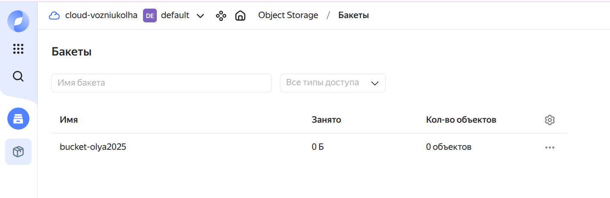

4. Созданы VPC с подсетями в разных регионах (изначально была ошибка, проверила доступность сетей, исправила - указывалась сеть из региона С, но она оказалась в DOWN)

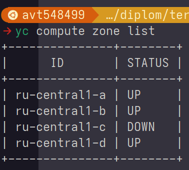

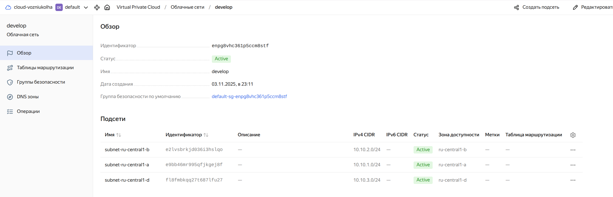

5. Финальные результаты создания и прогона `terraform`

* создание ресурсов

**cli**

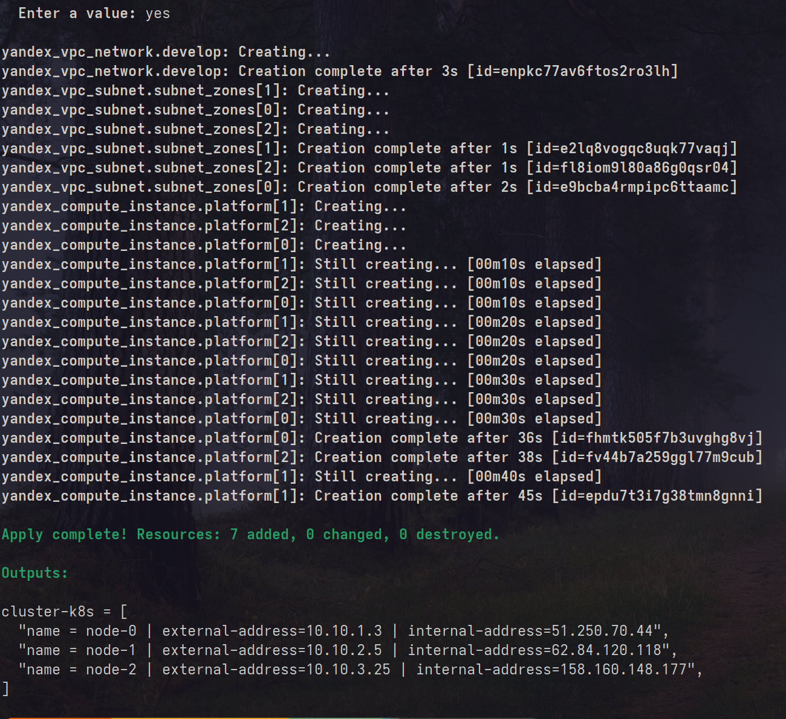

**YC**

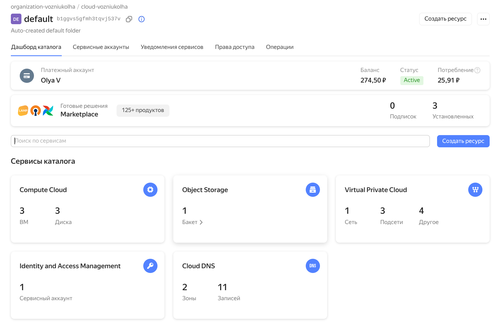

* удаление ресурсов

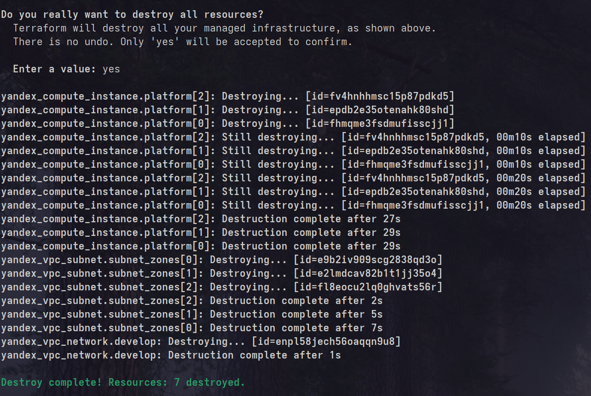

## Создание Kubernetes кластера

1. Написан плейбук для настройки кластера на нодах [k8s-cluster.yaml](./ansible/k8s-cluster.yaml)

**Результат прогона плейбука**

```sh
ansible-playbook -i prod.yaml k8s-cluster.yaml --ssh-common-args='-o StrictHostKeyChecking=no'

PLAY [Configuration Kubernetes nodes] *********************************************************************************************************************************************************************

TASK [Gathering Facts] ************************************************************************************************************************************************************************************
[WARNING]: Host 'worker-node-2' is using the discovered Python interpreter at '/usr/bin/python3.8', but future installation of another Python interpreter could cause a different interpreter to be discovered. See https://docs.ansible.com/ansible-core/2.19/reference_appendices/interpreter_discovery.html for more information.
ok: [worker-node-2]
[WARNING]: Host 'master-node' is using the discovered Python interpreter at '/usr/bin/python3.8', but future installation of another Python interpreter could cause a different interpreter to be discovered. See https://docs.ansible.com/ansible-core/2.19/reference_appendices/interpreter_discovery.html for more information.
ok: [master-node]
[WARNING]: Host 'worker-node-1' is using the discovered Python interpreter at '/usr/bin/python3.8', but future installation of another Python interpreter could cause a different interpreter to be discovered. See https://docs.ansible.com/ansible-core/2.19/reference_appendices/interpreter_discovery.html for more information.
ok: [worker-node-1]

TASK [Turn off swap] **************************************************************************************************************************************************************************************
changed: [worker-node-2]
changed: [master-node]
changed: [worker-node-1]

TASK [Load modules] ***************************************************************************************************************************************************************************************
changed: [master-node]
changed: [worker-node-2]
changed: [worker-node-1]

TASK [Add configuration for automatically modules loaded] *************************************************************************************************************************************************
changed: [master-node]
changed: [worker-node-1]
changed: [worker-node-2]

TASK [Setup sysctl params] ********************************************************************************************************************************************************************************
changed: [master-node] => (item=net.bridge.bridge-nf-call-iptables)
changed: [worker-node-2] => (item=net.bridge.bridge-nf-call-iptables)
changed: [worker-node-1] => (item=net.bridge.bridge-nf-call-iptables)
changed: [worker-node-2] => (item=net.ipv4.ip_forward)
changed: [master-node] => (item=net.ipv4.ip_forward)
changed: [worker-node-1] => (item=net.ipv4.ip_forward)
changed: [worker-node-2] => (item=net.bridge.bridge-nf-call-ip6tables)
changed: [master-node] => (item=net.bridge.bridge-nf-call-ip6tables)
changed: [worker-node-1] => (item=net.bridge.bridge-nf-call-ip6tables)

TASK [Add Docker GPG apt Key] *****************************************************************************************************************************************************************************
changed: [worker-node-2]
changed: [worker-node-1]
changed: [master-node]

TASK [Add Docker Repository] ******************************************************************************************************************************************************************************
changed: [worker-node-2]
changed: [worker-node-1]
changed: [master-node]

TASK [Install the containerd package] *********************************************************************************************************************************************************************
changed: [worker-node-2]
changed: [worker-node-1]
changed: [master-node]

TASK [Create a configuration file for containerd and set it to default] ***********************************************************************************************************************************
changed: [worker-node-2]
changed: [master-node]
changed: [worker-node-1]

TASK [Set cgroupdriver to systemd] ************************************************************************************************************************************************************************
changed: [worker-node-2]
changed: [master-node]
changed: [worker-node-1]

TASK [Restart containerd package] *************************************************************************************************************************************************************************
changed: [worker-node-2]
changed: [master-node]
changed: [worker-node-1]

TASK [mkdir keyrings] *************************************************************************************************************************************************************************************
changed: [worker-node-2]
changed: [master-node]
changed: [worker-node-1]

TASK [Add gpg key k8s] ************************************************************************************************************************************************************************************
changed: [worker-node-2]
changed: [master-node]
changed: [worker-node-1]

TASK [Add the Kubernetes repository] **********************************************************************************************************************************************************************
changed: [worker-node-2]
changed: [master-node]
changed: [worker-node-1]

TASK [Update Repository cache] ****************************************************************************************************************************************************************************
ok: [worker-node-2]
ok: [master-node]
ok: [worker-node-1]

TASK [Install all Kubernetes modules (kubelet, kubeadm, kubectl)] *****************************************************************************************************************************************
changed: [worker-node-2]
changed: [master-node]
changed: [worker-node-1]

TASK [Enable kubelet] *************************************************************************************************************************************************************************************
changed: [worker-node-2]
changed: [master-node]
changed: [worker-node-1]

PLAY RECAP ************************************************************************************************************************************************************************************************
master-node                : ok=17   changed=15   unreachable=0    failed=0    skipped=0    rescued=0    ignored=0   
worker-node-1              : ok=17   changed=15   unreachable=0    failed=0    skipped=0    rescued=0    ignored=0   
worker-node-2              : ok=17   changed=15   unreachable=0    failed=0    skipped=0    rescued=0    ignored=0   
```

2. Установка мастера `kubeadm init` - инициализация кластера

**Эта команда подготовит и установит все необходимое для работы вашего Kubernetes кластера, а также протестирует его работоспособность**

> В конце выполнения kubeadm выдаст вам команду и токен для подключения ваших вычислительных узлов (результат внизу)

```sh
ubuntu@node-0:~$ sudo kubeadm init

I1103 20:44:11.221779    5295 version.go:256] remote version is much newer: v1.34.1; falling back to: stable-1.28
[init] Using Kubernetes version: v1.28.15
[preflight] Running pre-flight checks
[preflight] Pulling images required for setting up a Kubernetes cluster
[preflight] This might take a minute or two, depending on the speed of your internet connection
[preflight] You can also perform this action in beforehand using 'kubeadm config images pull'
W1103 20:44:23.283157    5295 checks.go:835] detected that the sandbox image "registry.k8s.io/pause:3.8" of the container runtime is inconsistent with that used by kubeadm. It is recommended that using "registry.k8s.io/pause:3.9" as the CRI sandbox image.
[certs] Using certificateDir folder "/etc/kubernetes/pki"
[certs] Generating "ca" certificate and key
[certs] Generating "apiserver" certificate and key
[certs] apiserver serving cert is signed for DNS names [kubernetes kubernetes.default kubernetes.default.svc kubernetes.default.svc.cluster.local node-0] and IPs [10.96.0.1 10.10.1.13]
[certs] Generating "apiserver-kubelet-client" certificate and key
[certs] Generating "front-proxy-ca" certificate and key
[certs] Generating "front-proxy-client" certificate and key
[certs] Generating "etcd/ca" certificate and key
[certs] Generating "etcd/server" certificate and key
[certs] etcd/server serving cert is signed for DNS names [localhost node-0] and IPs [10.10.1.13 127.0.0.1 ::1]
[certs] Generating "etcd/peer" certificate and key
[certs] etcd/peer serving cert is signed for DNS names [localhost node-0] and IPs [10.10.1.13 127.0.0.1 ::1]
[certs] Generating "etcd/healthcheck-client" certificate and key
[certs] Generating "apiserver-etcd-client" certificate and key
[certs] Generating "sa" key and public key
[kubeconfig] Using kubeconfig folder "/etc/kubernetes"
[kubeconfig] Writing "admin.conf" kubeconfig file
[kubeconfig] Writing "kubelet.conf" kubeconfig file
[kubeconfig] Writing "controller-manager.conf" kubeconfig file
[kubeconfig] Writing "scheduler.conf" kubeconfig file
[etcd] Creating static Pod manifest for local etcd in "/etc/kubernetes/manifests"
[control-plane] Using manifest folder "/etc/kubernetes/manifests"
[control-plane] Creating static Pod manifest for "kube-apiserver"
[control-plane] Creating static Pod manifest for "kube-controller-manager"
[control-plane] Creating static Pod manifest for "kube-scheduler"
[kubelet-start] Writing kubelet environment file with flags to file "/var/lib/kubelet/kubeadm-flags.env"
[kubelet-start] Writing kubelet configuration to file "/var/lib/kubelet/config.yaml"
[kubelet-start] Starting the kubelet
[wait-control-plane] Waiting for the kubelet to boot up the control plane as static Pods from directory "/etc/kubernetes/manifests". This can take up to 4m0s
[apiclient] All control plane components are healthy after 6.502387 seconds
[upload-config] Storing the configuration used in ConfigMap "kubeadm-config" in the "kube-system" Namespace
[kubelet] Creating a ConfigMap "kubelet-config" in namespace kube-system with the configuration for the kubelets in the cluster
[upload-certs] Skipping phase. Please see --upload-certs
[mark-control-plane] Marking the node node-0 as control-plane by adding the labels: [node-role.kubernetes.io/control-plane node.kubernetes.io/exclude-from-external-load-balancers]
[mark-control-plane] Marking the node node-0 as control-plane by adding the taints [node-role.kubernetes.io/control-plane:NoSchedule]
[bootstrap-token] Using token: luggq7.dn115vfo0u40lonl
[bootstrap-token] Configuring bootstrap tokens, cluster-info ConfigMap, RBAC Roles
[bootstrap-token] Configured RBAC rules to allow Node Bootstrap tokens to get nodes
[bootstrap-token] Configured RBAC rules to allow Node Bootstrap tokens to post CSRs in order for nodes to get long term certificate credentials
[bootstrap-token] Configured RBAC rules to allow the csrapprover controller automatically approve CSRs from a Node Bootstrap Token
[bootstrap-token] Configured RBAC rules to allow certificate rotation for all node client certificates in the cluster
[bootstrap-token] Creating the "cluster-info" ConfigMap in the "kube-public" namespace
[kubelet-finalize] Updating "/etc/kubernetes/kubelet.conf" to point to a rotatable kubelet client certificate and key
[addons] Applied essential addon: CoreDNS
[addons] Applied essential addon: kube-proxy

Your Kubernetes control-plane has initialized successfully!

To start using your cluster, you need to run the following as a regular user:

  mkdir -p $HOME/.kube
  sudo cp -i /etc/kubernetes/admin.conf $HOME/.kube/config
  sudo chown $(id -u):$(id -g) $HOME/.kube/config

Alternatively, if you are the root user, you can run:

  export KUBECONFIG=/etc/kubernetes/admin.conf

You should now deploy a pod network to the cluster.
Run "kubectl apply -f [podnetwork].yaml" with one of the options listed at:
  https://kubernetes.io/docs/concepts/cluster-administration/addons/

Then you can join any number of worker nodes by running the following on each as root:

kubeadm join 10.10.1.13:6443 --token luggq7.dn115vfo0u40lonl \
	--discovery-token-ca-cert-hash sha256:73929b5b1b1a91654571bbb36c27883e074274eee72037c443e7942e9fdf5a7b 
```

3. Даем доступ для обычного пользователя

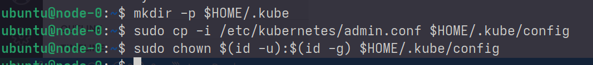

4. CNI-controller (calico)

```sh
ubuntu@node-0:~$ curl -f https://raw.githubusercontent.com/projectcalico/calico/v3.26.1/manifests/calico.yaml -O
  % Total    % Received % Xferd  Average Speed   Time    Time     Time  Current
                                 Dload  Upload   Total   Spent    Left  Speed
100  238k  100  238k    0     0   751k      0 --:--:-- --:--:-- --:--:--  751k
ubuntu@node-0:~$ kubectl apply -f calico.yaml
poddisruptionbudget.policy/calico-kube-controllers created
serviceaccount/calico-kube-controllers created
serviceaccount/calico-node created
serviceaccount/calico-cni-plugin created
configmap/calico-config created
customresourcedefinition.apiextensions.k8s.io/bgpconfigurations.crd.projectcalico.org created
customresourcedefinition.apiextensions.k8s.io/bgpfilters.crd.projectcalico.org created
customresourcedefinition.apiextensions.k8s.io/bgppeers.crd.projectcalico.org created
customresourcedefinition.apiextensions.k8s.io/blockaffinities.crd.projectcalico.org created
customresourcedefinition.apiextensions.k8s.io/caliconodestatuses.crd.projectcalico.org created
customresourcedefinition.apiextensions.k8s.io/clusterinformations.crd.projectcalico.org created
customresourcedefinition.apiextensions.k8s.io/felixconfigurations.crd.projectcalico.org created
customresourcedefinition.apiextensions.k8s.io/globalnetworkpolicies.crd.projectcalico.org created
customresourcedefinition.apiextensions.k8s.io/globalnetworksets.crd.projectcalico.org created
customresourcedefinition.apiextensions.k8s.io/hostendpoints.crd.projectcalico.org created
customresourcedefinition.apiextensions.k8s.io/ipamblocks.crd.projectcalico.org created
customresourcedefinition.apiextensions.k8s.io/ipamconfigs.crd.projectcalico.org created
customresourcedefinition.apiextensions.k8s.io/ipamhandles.crd.projectcalico.org created
customresourcedefinition.apiextensions.k8s.io/ippools.crd.projectcalico.org created
customresourcedefinition.apiextensions.k8s.io/ipreservations.crd.projectcalico.org created
customresourcedefinition.apiextensions.k8s.io/kubecontrollersconfigurations.crd.projectcalico.org created
customresourcedefinition.apiextensions.k8s.io/networkpolicies.crd.projectcalico.org created
customresourcedefinition.apiextensions.k8s.io/networksets.crd.projectcalico.org created
clusterrole.rbac.authorization.k8s.io/calico-kube-controllers created
clusterrole.rbac.authorization.k8s.io/calico-node created
clusterrole.rbac.authorization.k8s.io/calico-cni-plugin created
clusterrolebinding.rbac.authorization.k8s.io/calico-kube-controllers created
clusterrolebinding.rbac.authorization.k8s.io/calico-node created
clusterrolebinding.rbac.authorization.k8s.io/calico-cni-plugin created
daemonset.apps/calico-node created
deployment.apps/calico-kube-controllers created
```

5. Подлючаем ноды к кластеру

- результаты:

**node-1**

```sh
ubuntu@node-1:~$ sudo kubeadm join 10.10.1.13:6443 --token luggq7.dn115vfo0u40lonl --discovery-token-ca-cert-hash
sudo kubeadm join 10.10.1.13:6443 --token luggq7.dn115vfo0u40lonl --discovery-token-ca-cert-hash sha256:73929b5b1b1a91654571bbb36c27883e074274eee72037c443e7942e9fdf5a7b
[preflight] Running pre-flight checks
[preflight] Reading configuration from the cluster...
[preflight] FYI: You can look at this config file with 'kubectl -n kube-system get cm kubeadm-config -o yaml'
[kubelet-start] Writing kubelet configuration to file "/var/lib/kubelet/config.yaml"
[kubelet-start] Writing kubelet environment file with flags to file "/var/lib/kubelet/kubeadm-flags.env"
[kubelet-start] Starting the kubelet
[kubelet-start] Waiting for the kubelet to perform the TLS Bootstrap...

This node has joined the cluster:
* Certificate signing request was sent to apiserver and a response was received.
* The Kubelet was informed of the new secure connection details.

Run 'kubectl get nodes' on the control-plane to see this node join the cluster.
```

**node-2**

```sh
ubuntu@node-2:~$ sudo kubeadm join 10.10.1.13:6443 --token luggq7.dn115vfo0u40lonl --discovery-token-ca-cert-hash sha256:73929b5b1b1a91654571bbb36c27883e074274eee72037c443e7942e9fdf5a7b
[preflight] Running pre-flight checks
[preflight] Reading configuration from the cluster...
[preflight] FYI: You can look at this config file with 'kubectl -n kube-system get cm kubeadm-config -o yaml'
[kubelet-start] Writing kubelet configuration to file "/var/lib/kubelet/config.yaml"
[kubelet-start] Writing kubelet environment file with flags to file "/var/lib/kubelet/kubeadm-flags.env"
[kubelet-start] Starting the kubelet
[kubelet-start] Waiting for the kubelet to perform the TLS Bootstrap...

This node has joined the cluster:
* Certificate signing request was sent to apiserver and a response was received.
* The Kubelet was informed of the new secure connection details.

Run 'kubectl get nodes' on the control-plane to see this node join the cluster.
```

6. Проверка кластера после присоединения нод

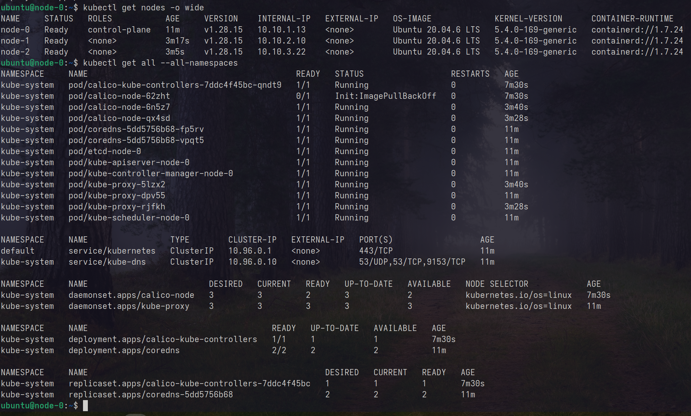

7. Дополнительно

Чтобы конфиг работал на локальной тачке, необходимо перегенерить серты

**процесс**

```sh
ubuntu@node-0:~$ sudo cat <<EOF | sudo tee /etc/kubernetes/kubeadm-config.yaml
> apiVersion: kubeadm.k8s.io/v1beta3
> kind: ClusterConfiguration
> controlPlaneEndpoint: "51.250.75.101:6443"
> apiServer:
>   certSANs:
>   - "51.250.75.101"
>   - "10.96.0.1"
>   - "10.10.1.13"
>   - "localhost"
>   - "127.0.0.1"
> networking:
>   podSubnet: "10.244.0.0/16"
> EOF
apiVersion: kubeadm.k8s.io/v1beta3
kind: ClusterConfiguration
controlPlaneEndpoint: "51.250.75.101:6443"
apiServer:
  certSANs:
  - "51.250.75.101"
  - "10.96.0.1"
  - "10.10.1.13"
  - "localhost"
  - "127.0.0.1"
networking:
  podSubnet: "10.244.0.0/16"
ubuntu@node-0:~$ sudo cp -r /etc/kubernetes/pki /etc/kubernetes/pki-backup
ubuntu@node-0:~$ sudo rm /etc/kubernetes/pki/apiserver.crt
ubuntu@node-0:~$ sudo rm /etc/kubernetes/pki/apiserver.key
ubuntu@node-0:~$ sudo kubeadm init phase certs apiserver --config /etc/kubernetes/kubeadm-config.yaml
I1103 21:32:09.396340    2421 version.go:256] remote version is much newer: v1.34.1; falling back to: stable-1.28
[certs] Generating "apiserver" certificate and key
[certs] apiserver serving cert is signed for DNS names [kubernetes kubernetes.default kubernetes.default.svc kubernetes.default.svc.cluster.local localhost node-0] and IPs [10.96.0.1 10.10.1.13 51.250.75.101 127.0.0.1]
ubuntu@node-0:~$ sudo docker ps | grep k8s_kube-apiserver | awk '{print $1}' | xargs sudo docker restart
sudo: docker: command not found
sudo: docker: command not found
ubuntu@node-0:~$ sudo kubeadm init phase control-plane all --config /etc/kubernetes/kubeadm-config.yaml
I1103 21:32:38.399306    2597 version.go:256] remote version is much newer: v1.34.1; falling back to: stable-1.28
[control-plane] Using manifest folder "/etc/kubernetes/manifests"
[control-plane] Creating static Pod manifest for "kube-apiserver"
[control-plane] Creating static Pod manifest for "kube-controller-manager"
[control-plane] Creating static Pod manifest for "kube-scheduler"
ubuntu@node-0:~$ sudo systemctl restart kubelet
ubuntu@node-0:~$ sudo kubeadm init phase kubeconfig admin --config /etc/kubernetes/kubeadm-config.yaml
I1103 21:32:57.321496    2932 version.go:256] remote version is much newer: v1.34.1; falling back to: stable-1.28
W1103 21:32:57.935176    2932 kubeconfig.go:264] a kubeconfig file "/etc/kubernetes/admin.conf" exists already but has an unexpected API Server URL: expected: https://51.250.75.101:6443, got: https://10.10.1.13:6443
[kubeconfig] Using existing kubeconfig file: "/etc/kubernetes/admin.conf"
ubuntu@node-0:~$ sudo cp /etc/kubernetes/admin.conf $HOME/.kube/config
ubuntu@node-0:~$ sudo chown $(id -u):$(id -g) $HOME/.kube/config
ubuntu@node-0:~$ openssl x509 -in /etc/kubernetes/pki/apiserver.crt -text -noout | grep -A 10 "Subject Alternative Name"
            X509v3 Subject Alternative Name: 
                DNS:kubernetes, DNS:kubernetes.default, DNS:kubernetes.default.svc, DNS:kubernetes.default.svc.cluster.local, DNS:localhost, DNS:node-0, IP Address:10.96.0.1, IP Address:10.10.1.13, IP Address:51.250.75.101, IP Address:127.0.0.1
    Signature Algorithm: sha256WithRSAEncryption
         31:ac:da:53:6b:d4:08:43:5a:61:a7:5e:c2:32:59:c0:af:f7:
         f3:1e:ab:9f:47:17:37:e7:38:81:be:40:14:6a:85:76:e4:e4:
         02:4e:b7:0e:85:9e:d5:aa:65:3d:b9:ef:d4:36:2d:d7:fd:2c:
         18:9b:42:1c:6b:9c:68:5f:55:6c:56:e5:45:b3:4d:da:a2:62:
         f5:5a:de:49:53:12:cc:45:bf:ae:9a:21:49:a4:5a:c3:a6:6f:
         45:d6:0d:7e:ce:08:92:3b:00:7b:22:61:5d:6f:6b:40:cc:c0:
         23:59:4b:79:94:5d:6e:15:14:2a:ea:a8:7f:c6:17:3b:62:b9:
         d8:61:0f:40:52:de:f3:17:b8:34:c7:fa:6c:80:57:0e:97:d7:
```
**результат**

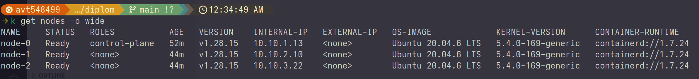

## Создание тестового приложения

1. [Репозиторий с простым приложением](./app/)

2. `Dockerfile` (собираем, пушим в репо)

```sh
FROM nginx:1.23.3

# Configuration 
ADD conf /etc/nginx
# Content
ADD content /usr/share/nginx/html

EXPOSE 80 
```

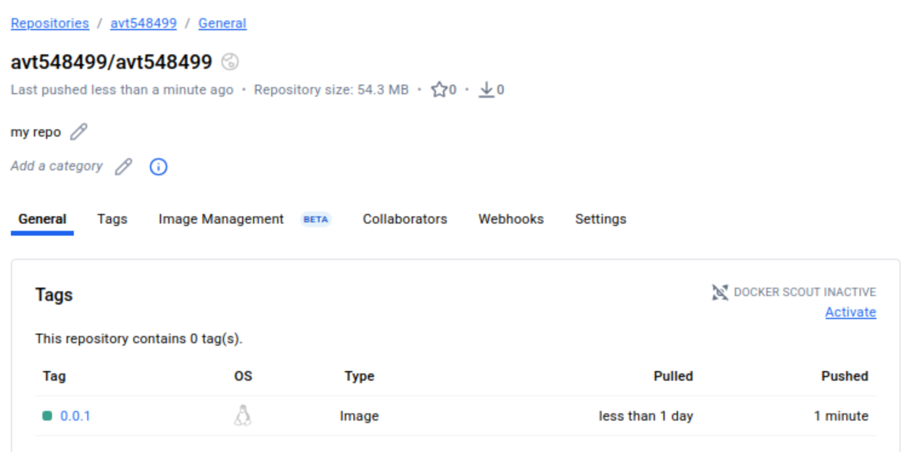

3. Применяем конфиг, проверяем ресурсы

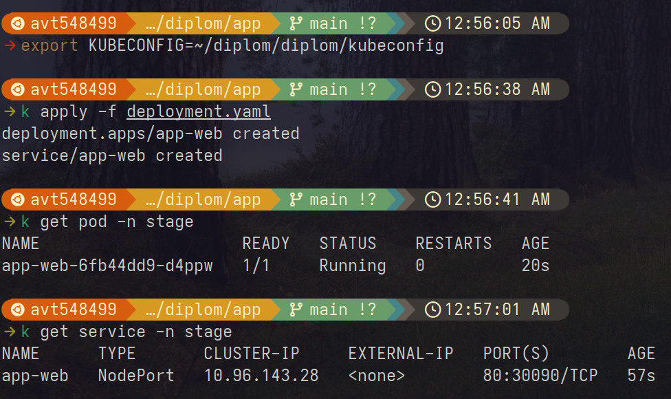

4. Доступ по нодпорту

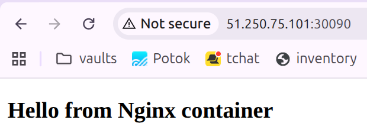

## Подготовка cистемы мониторинга

1. Использовались ресурсы из [официального репозитория kube-prometheus](https://github.com/prometheus-operator/kube-prometheus) - скопировано в [папку monitoring](./monitoring/)

2. Инициализация мониторинга 


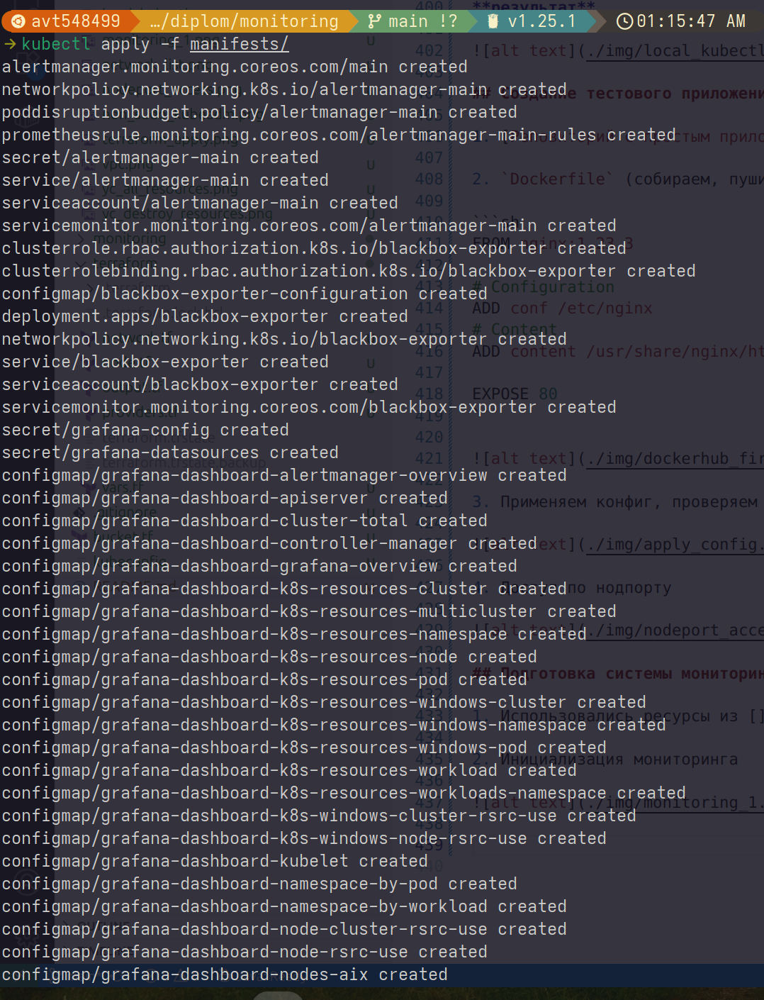

**результат**

```sh
k get all -n monitoring
NAME                                       READY   STATUS    RESTARTS   AGE
pod/alertmanager-main-0                    2/2     Running   0          66s
pod/alertmanager-main-1                    2/2     Running   0          66s
pod/alertmanager-main-2                    2/2     Running   0          66s
pod/blackbox-exporter-74b6d49587-bcjlr     3/3     Running   0          83s
pod/grafana-784486bb95-8qt5c               1/1     Running   0          80s
pod/kube-state-metrics-6fc5fb9654-hfhr8    3/3     Running   0          80s
pod/node-exporter-p52qd                    2/2     Running   0          79s
pod/node-exporter-sfh7p                    2/2     Running   0          79s
pod/node-exporter-x6pp9                    2/2     Running   0          79s
pod/prometheus-adapter-77f8587965-2tr67    1/1     Running   0          78s
pod/prometheus-adapter-77f8587965-wgg9c    1/1     Running   0          78s
pod/prometheus-k8s-0                       2/2     Running   0          66s
pod/prometheus-k8s-1                       2/2     Running   0          66s
pod/prometheus-operator-69d96b54b5-7b888   2/2     Running   0          78s

NAME                            TYPE        CLUSTER-IP      EXTERNAL-IP   PORT(S)                      AGE
service/alertmanager-main       ClusterIP   10.110.64.138   <none>        9093/TCP,8080/TCP            83s
service/alertmanager-operated   ClusterIP   None            <none>        9093/TCP,9094/TCP,9094/UDP   66s
service/blackbox-exporter       ClusterIP   10.105.66.127   <none>        9115/TCP,19115/TCP           83s
service/grafana                 ClusterIP   10.96.49.83     <none>        3000/TCP                     80s
service/kube-state-metrics      ClusterIP   None            <none>        8443/TCP,9443/TCP            80s
service/node-exporter           ClusterIP   None            <none>        9100/TCP                     79s
service/prometheus-adapter      ClusterIP   10.107.135.28   <none>        443/TCP                      78s
service/prometheus-k8s          ClusterIP   10.102.216.88   <none>        9090/TCP,8080/TCP            79s
service/prometheus-operated     ClusterIP   None            <none>        9090/TCP                     66s
service/prometheus-operator     ClusterIP   None            <none>        8443/TCP                     78s

NAME                           DESIRED   CURRENT   READY   UP-TO-DATE   AVAILABLE   NODE SELECTOR            AGE
daemonset.apps/node-exporter   3         3         3       3            3           kubernetes.io/os=linux   80s

NAME                                  READY   UP-TO-DATE   AVAILABLE   AGE
deployment.apps/blackbox-exporter     1/1     1            1           83s
deployment.apps/grafana               1/1     1            1           81s
deployment.apps/kube-state-metrics    1/1     1            1           80s
deployment.apps/prometheus-adapter    2/2     2            2           78s
deployment.apps/prometheus-operator   1/1     1            1           78s

NAME                                             DESIRED   CURRENT   READY   AGE
replicaset.apps/blackbox-exporter-74b6d49587     1         1         1       83s
replicaset.apps/grafana-784486bb95               1         1         1       81s
replicaset.apps/kube-state-metrics-6fc5fb9654    1         1         1       80s
replicaset.apps/prometheus-adapter-77f8587965    2         2         2       78s
replicaset.apps/prometheus-operator-69d96b54b5   1         1         1       78s

NAME                                 READY   AGE
statefulset.apps/alertmanager-main   3/3     66s
statefulset.apps/prometheus-k8s      2/2     66s
```

3. Чтобы подключиться, удаляем сетевые политики и патчим сервис графаны

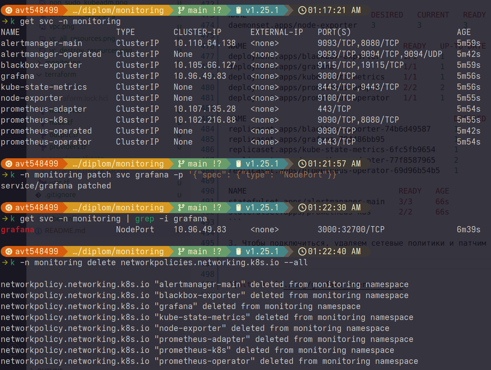

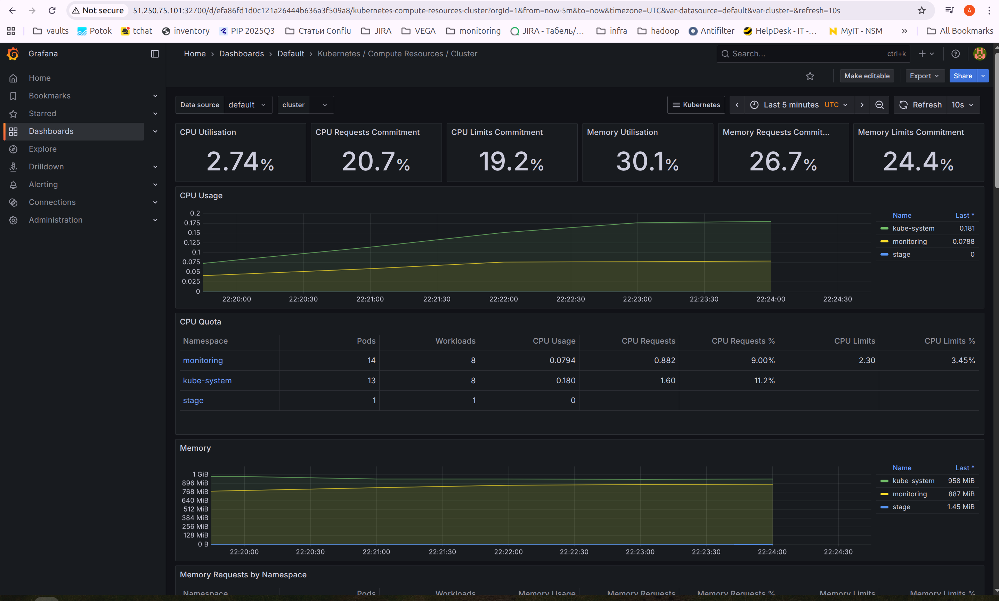

## Установка и настройка CI/CD

